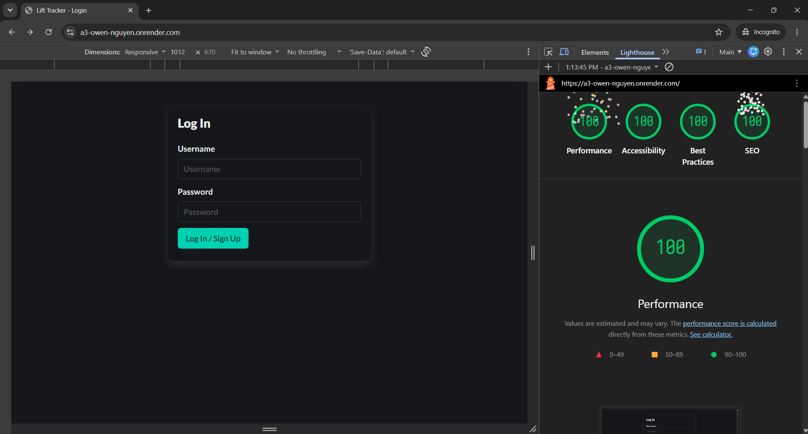
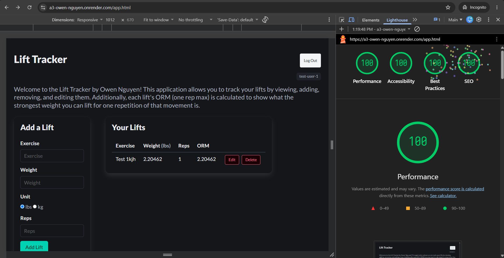

## Lift Tracker

https://a3-owen-nguyen.onrender.com

Lift Tracker is a two-tier web application built with a database (MongoDB), Express server, and Bulma CSS template.
Users can log their gym weightlifting sets (With the lift name, weight in lb/kg, and reps). 
Users can create an account, and log in. Each user only sees their data. Once logged in, they can add, edit, and delete sets.
Additionally, each set has a server-calculated ORM, which is the one-rep max of that particular set calculated using the Epley formula. 

### Goal
The goal of my application is to extend my a2 lift tracker, by replacing the server-side data storage with actual database long-term storage (MongoDB).
Additionally, the goal is to implement a real backend framework (Express server) along with user authentication.

### Challenges
The most challenging part for me was determining what middleware I needed (and also the order of it). Additionally, I struggled a little with implementing
user authentication, and it took me a while to understand how the server, backend, and client communicated regarding cookies and user data (username, hashed passwords).

### Authentication
I used username + password authentication with express sessions and password hashing via bycryptjs. I originally was planning on not having much complexity
regarding authentication, but I figured adding it would be a good challenge. Note that new accounts are created on logins where the username doesn't exist in the DB. 
There is no seperate sign up and log in.

### Framework
I used the Bulma CSS framework. I found this in the `awesome-css-frameworks` repo, and was drawn to it due to its modern style, and how it is based on flexbox.
All of my pre-existing CSS could be deleted, and I let Bulma handle the majority of the styling. The only thing I changed was to keep my google font (Lato).

## Technical Achievements
- **Tech Achievement 1 (2 points)**: Middleware packages used:
  - `express-session`: This middleware package manages login sessions. It creates and sends cookies (contains signed session ID), and stores
  the session data on the server. It also lets routes check if a user is logged in before executing.
  - `morgan`: This middleware package logs every incoming HTTP request to the console for debugging purposes.
- **Tech Achievement 2 (5 points)** Lighthouse tests
  - Note that my site passes the requirements in an *INCOGNITO BROWSER*. Approved by Professor Roberts.
 
- **CUSTOM Tech Achievement 3 (3 points request)** In-place table editing:
  - I implemented in-place table editing, which required a decent amount of thinking how to structure and restructure the html when a user clicked edit / save.
  Clicking the edit button converts that specific row into input fields. It also turns the edit button into a save button. This was challenging because it required
  tracking of each row's inputs and edit state, along with event listeners, which was difficult when figuring out how and when to render the whole table.

### Design/Evaluation Achievements
- **Design Achievement 1 (5 points)**: CRAP Principles
  - **CONTRAST**
    - My website uses the Bulma dark theme as a base (it came pre-structured with the Bulma framework). Bulma automatically gives professional styles, including putting light text against a dark background. Additionally, the buttons stand out a lot compared to the elements behind it, making it easy to spot and determine what the actionable elements of the page are. For example, the Edit and Delete buttons are red in an outlined style to specify that they make changes to the data. The Log In / Sign Up button and the Add Lift button are the main functionalities of my website, and therefore have a very strong teal color that stands out. Even further, the input elements have a blue border around them, clearly providing contrast between the form element and the background. The user can clearly determine where they are going to be typing. Heading sizes also create contrast in my website; the page title creates a nice contrast with the smaller subtitle beneath it.
  - **REPETITON**
    - For repetition, I reuse the .box card component for the “Add a Lift” and “Your Lifts” sections on the main app page. It is also used on the login form page. This is very important because the repetition suggests to the user that it is a contained unit of content; every time they see this card with rounded border and white shadows, they know it contains informative content. Additionally, CSS styling is consistent across the website. Since I used the Bulma CSS framework, repetitive styles were easily applied across all website components. This includes button colors, heading sizes, spacing, etc. Lastly, the typography is consistent across the website. I used the google font Lato across both pages and all components.
  - **ALIGNMENT**
    - As for alignment, I researched how people use Bulma for form inputs, and figured out that they wrap them with a field and control tag. What this does is stack each form inputs vertically and left-aligned, exactly what the class readings suggested. This is because it is easy on the eye to read left-aligned text; all a user has to do is shift their vision vertically against the left edge of the form without needing to search for anything. On the main page, the “Add a Lift” and “Your Lift” boxes are placed side by side (and vertically for small display sizes” so they read as two equal pieces of content. Lastly, inside the lift table, lifts are displayed neatly; each column is vertically aligned down its own column across every row, which is again easy on the eye.
  - **PROXIMITY**
    - Lastly, for proximity, every form has its <label> tag placed directly above it. This makes it so that the relationship between a label and input is clear; the user shouldn’t be confused at all with regards to which input relates to each label. In the lift table, the edit and delete buttons are aligned symmetrically in each row’s final column. Placing them directly next to the data shows proximity; the user can tell that each row has its own edit and delete buttons with no ambiguity. Finally, on the login page, the error/success message for when a user logs in successfully or with an error is displayed right below the form, so that the user knows that that feedback is directly correlated with the login form.
